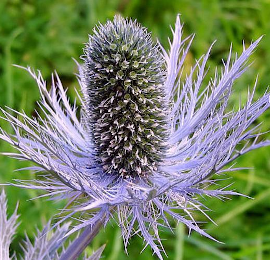
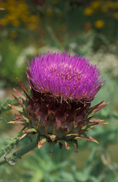

**Image classification** is the simplest and least computational expensive task, as it classifies whole images,
assigning them a category.

 

Before you delve into training models, take a look at how you need to [annotate your data](annotate.md).

The following frameworks are available:

* [MMClassification](mmclassification.md)
* [wai.tfimageclass](wai.tfimageclass.md)
