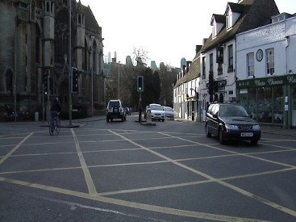
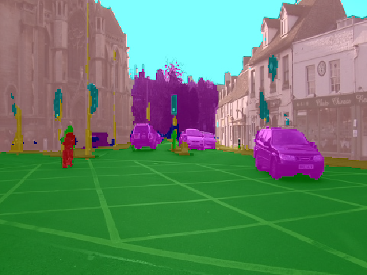

[Image Segmentation Keras](https://github.com/divamgupta/image-segmentation-keras) is a Keras/Tensorflow
based image segmentation framework. Custom docker images with additional tools are available from here:

[https://github.com/waikato-datamining/tensorflow/tree/master/image-segmentation-keras](https://github.com/waikato-datamining/tensorflow/tree/master/image-segmentation-keras)


# Prerequisites
Make sure you have the directory structure created as outlined in the [Prerequisites](../prerequisites.md).


# Data

In this example, we will use the [CamVid-12](https://datasets.cms.waikato.ac.nz/ufdl/camvid12/)
dataset, which consists of still images from dashcam videos from a city environment (12 different labels).

Download the dataset from the following URL into the *data* directory and extract it:

[https://datasets.cms.waikato.ac.nz/ufdl/data/camvid12/camvid12-grayscale.zip](https://datasets.cms.waikato.ac.nz/ufdl/data/camvid12/camvid12-grayscale.zip)

Once extracted, rename the *grayscale* directory to *camvid-grayscale*.

Now we have to convert the format from *grayscale* into *blue channel*, which the framework uses.
We can do this by using the [image-dataset-converter](https://github.com/waikato-datamining/image-dataset-converter) library. 
At the same time, we can split the dataset into *train*, *validation* and *test* subsets.

From within the `applied_deep_learning` directory, run the following command:

```bash
docker run --rm -u $(id -u):$(id -g) \
  -v `pwd`:/workspace \
  -t waikatodatamining/image-dataset-converter:latest \
  idc-convert \
    -l INFO \
    from-grayscale-is \
      -i "/workspace/data/camvid-grayscale/*.png" \
      --labels sky building pole road pavement tree signsymbol fence car pedestrian bicyclist unlabelled \
    to-blue-channel-is \
      -o /workspace/data/camvid-bluechannel-split \
      --split_names train val test \
      --split_ratios 70 15 15
```


# Training

For training, we will use the following docker image:

```
waikatodatamining/image-segmentation-keras:1.14.0_0.3.0
```

The training script is called `keras_seg_train`, for which we can invoke the help screen as follows:

```bash
docker run --rm -t waikatodatamining/image-segmentation-keras:1.14.0_0.3.0 keras_seg_train --help 
```

It is good practice creating a separate sub-directory for each training run, with a directory name that hints at
what dataset and model were used. So for our first training run, which will use mainly default parameters, we will 
create the following directory in the `output` folder:

```
camvid12-keras-unet50
```

Image Segmentation Keras does not use a config file, but can be configured via command-line parameters
instead:

* the number of classes (`--n_classes`) is actual classes plus background 
* the width/height of the inputs must be multiples of 32 (`--input_height`, `--input_width`) 
* the output directory is specified via `--checkpoints_path` (make sure to have a trailing slash!) 
* in our case, the images and the annotations reside in the same directories, so `--train_images` and `--train_annotations` 
  point to the same directory (analog for `--val_images` and `--val_annotations`)
* with `--epochs` you can specify for how long the model will get trained
* `--model_name` specifies the architecture and backend (see [here](https://github.com/divamgupta/image-segmentation-keras#models) for available options)

Kick off the training of a U-Net with a ResNet50 backend using the following command:

```bash
docker run --rm \
  -u $(id -u):$(id -g) \
  --gpus=all \
  -v `pwd`:/workspace \
  -v `pwd`/cache:/tmp/.keras \
  -t waikatodatamining/image-segmentation-keras:1.14.0_0.3.0 \
  keras_seg_train \
  --checkpoints_path /workspace/output/camvid12-keras-unet50/ \
  --train_images /workspace/data/camvid-bluechannel-split/train \
  --train_annotations /workspace/data/camvid-bluechannel-split/train \
  --val_images /workspace/data/camvid-bluechannel-split/val \
  --val_annotations /workspace/data/camvid-bluechannel-split/val \
  --epochs 10 \
  --n_classes 13 \
  --input_height 384 \
  --input_width 480 \
  --model_name resnet50_unet
```


# Predicting

Using the `keras_seg_poll` script, we can batch-process images placed in the `predictions/in` directory
as follows (e.g., from our *test* subset): 

```bash
docker run --rm \
  -u $(id -u):$(id -g) \
  --gpus=all \
  -v `pwd`:/workspace \
  -v `pwd`/cache:/tmp/.keras \
  -t waikatodatamining/image-segmentation-keras:1.14.0_0.3.0 \
  keras_seg_poll \
  --checkpoints_path /workspace/output/camvid12-keras-unet50/ \
  --prediction_in /workspace/predictions/in \
  --prediction_out /workspace/predictions/out
```

**Notes** 

* The predictions are output in *Indexed PNG* format.
* You can view the predictions with the ADAMS *Preview browser*:
  
    * [Indexed PNG](../../previewing_predictions/#imgseg_indexed)

**Example prediction**

 


