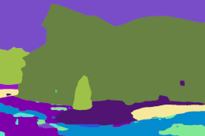

**Image segmentation** classifies individual pixels within an image, assigning them a label (i.e., a color).

| Input                          | Annotation/Output               |
| ------------------------------ | ------------------------------- |
|  |  |
|  |  |

Before you delve into training models, take a look at how you need to [annotate your data](annotate.md).

The following frameworks are available:

* [Image Segmentation Keras](image-segmentation-keras.md)
* [Segmentation models](segmentation_models.md)
* [MMSegmentation](mmsegmentation.md)
