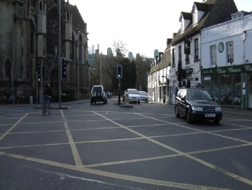
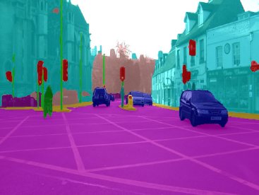

[MMSegmentation](https://github.com/open-mmlab/mmsegmentation) is a comprehensive and flexible
framework for image segmentation that offers a wide variety of architectures. Custom docker
images with additional tools are available from here:

[https://github.com/waikato-datamining/mmsegmentation](https://github.com/waikato-datamining/mmsegmentation)


# Prerequisites
Make sure you have the directory structure created as outlined in the [Prerequisites](../prerequisites.md).


# Data

In this example, we will use the [CamVid-12](https://datasets.cms.waikato.ac.nz/ufdl/camvid12/)
dataset, which consists of still images from dashcam videos from a city environment (12 different labels).

Download the dataset from the following URL into the *data* directory and extract it:

[https://datasets.cms.waikato.ac.nz/ufdl/data/camvid12/camvid12-grayscale.zip](https://datasets.cms.waikato.ac.nz/ufdl/data/camvid12/camvid12-grayscale.zip)

Once extracted, rename the *grayscale* directory to *camvid-grayscale*.

Noe we have to convert the format from *grayscale* into *indexed PNG*, which MMSegmentation uses.
We can do this by using the [wai.annotations](https://github.com/waikato-ufdl/wai-annotations) library. 
At the same time, we can split the dataset into *train*, *validation* and *test* subsets.

From within the `applied_deep_learning` directory, run the following command:

```bash
docker run --rm -u $(id -u):$(id -g) \
  -v `pwd`:/workspace \
  -t waikatoufdl/wai.annotations:latest \
  wai-annotations convert \
    from-grayscale-is \
      -i "/workspace/data/camvid-grayscale/*.png" \
      --labels sky building pole road pavement tree signsymbol fence car pedestrian bicyclist unlabelled \
    to-indexed-png-is \
      -o /workspace/data/camvid-indexed-split \
      --split-names train val test \
      --split-ratios 70 15 15
```


# Training

For training, we will use the following docker image:

```
waikatodatamining/mmsegmentation:0.25.0_cuda11.1
```

The training script is called `mmseg_train`, for which we can invoke the help screen as follows:

```bash
docker run --rm -t waikatodatamining/mmsegmentation:0.25.0_cuda11.1 mmseg_train --help 
```

It is good practice creating a separate sub-directory for each training run, with a directory name that hints at
what dataset and model were used. So for our first training run, which will use mainly default parameters, we will 
create the following directory in the `output` folder:

```
camvid12-mmseg-pspnet50
```

Before we can train, we will need to obtain and customize a config file. Within the container,
you can find example configurations for various architectures in the following directory:

```
/mmsegmentation/configs
```

Using the `mmseg_config` command, we can expand and dump one of these configurations for our
own purposes:

```bash
docker run --rm \
  -u $(id -u):$(id -g) \
  --gpus=all \
  -v `pwd`:/workspace \
  -v `pwd`/cache:/.cache \
  -v `pwd`/cache/torch:/.cache/torch \
  -t waikatodatamining/mmsegmentation:0.25.0_cuda11.1 \
  mmseg_config \
  --config /mmsegmentation/configs/pspnet/pspnet_r50-d8_512x1024_40k_cityscapes.py \
  --output_config /workspace/output/camvid12-mmseg-pspnet50/pspnet_r50.py
```

Open the `pspnet_r50.py` file in a text editor and perform the following operations:

* change `num_classes` to 12 (background not counted).
* change `dataset_type` to `ExternalDataset` and any occurrences of `type` in the `train`, `test`, `val` sections of the `data` dictionary.
* change `data_root` occurrences to `/workspace/data/camvid-indexed-split` (the directory above the `train` and `val` directories).
* change `img_dir` occurrences to `img_dir=data_root+'/DIR',` with `DIR` being the appropriate `train`, `val` or `test`
* do the same with `ann_dir`


Kick off the training with the following command:

```bash
docker run --rm \
  -u $(id -u):$(id -g) \
  --shm-size=8g \
  --gpus=all \
  -v `pwd`:/workspace \
  -v `pwd`/cache:/.cache \
  -v `pwd`/cache/torch:/.cache/torch \
  -e MMSEG_CLASSES="sky,building,pole,road,pavement,tree,signsymbol,fence,car,pedestrian,bicyclist,unlabelled" \
  -t waikatodatamining/mmsegmentation:0.25.0_cuda11.1 \
  mmseg_train \
  /workspace/output/camvid12-mmseg-pspnet50/pspnet_r50.py \
  --work-dir /workspace/output/camvid12-mmseg-pspnet50
```


# Predicting

Using the `mmseg_predict_poll` script, we can batch-process images placed in the `predictions/in` directory
as follows (e.g., from our *test* subset): 

```bash
docker run --rm \
  -u $(id -u):$(id -g) \
  --shm-size 8G \
  --gpus=all \
  -v `pwd`:/workspace \
  -v `pwd`/cache:/.cache \
  -v `pwd`/cache/torch:/.cache/torch \
  -e MMSEG_CLASSES="sky,building,pole,road,pavement,tree,signsymbol,fence,car,pedestrian,bicyclist,unlabelled" \
  -t waikatodatamining/mmsegmentation:0.25.0_cuda11.1 \
  mmseg_predict_poll \
  --model /workspace/output/camvid12-mmseg-pspnet50/latest.pth \
  --config /workspace/output/camvid12-mmseg-pspnet50/pspnet_r50.py \
  --prediction_in /workspace/predictions/in \
  --prediction_out /workspace/predictions/out
```

**Notes** 

* The predictions can either be output in *grayscale* (default) or *bluechannel* format (`--prediction_format`).
* You can view the predictions with the ADAMS *Preview browser*:
  
    * [Indexed PNG](../../previewing_predictions/#imgseg_indexed)

**Example prediction**

 


