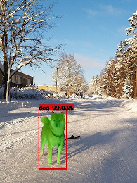
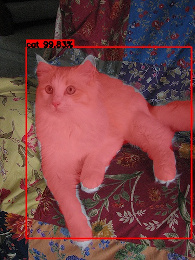

**Instance segmentation** not only finds objects within images, it also learns the shape of the objects rather
than just a simple rectangle/bounding box. However, this makes the algorithms computationally more expensive
and more memory hungry.

 

What to do next:

* [Annotate your data](annotate.md)
* [Choose a framework](frameworks.md)
