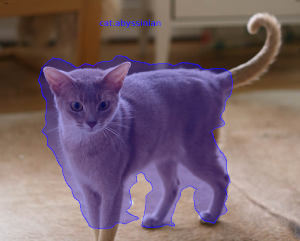

[MMDetection](https://github.com/open-mmlab/mmdetection) is a comprehensive and flexible
framework not only for object detection, but also for instance segmentation. Custom docker
images with additional tools are available from here:

[https://github.com/waikato-datamining/mmdetection](https://github.com/waikato-datamining/mmdetection)


# Prerequisites
Make sure you have the directory structure created as outlined in the [Prerequisites](../prerequisites.md).


# Data

In this example, we will use the [Oxford Pets](https://datasets.cms.waikato.ac.nz/ufdl/oxford-pets/)
dataset, which consists of 37 different categories of cats and dogs.

Download the dataset from the following URL into the *data* directory and extract it:

[https://datasets.cms.waikato.ac.nz/ufdl/data/oxford-pets/oxford-pets-adams.zip](https://datasets.cms.waikato.ac.nz/ufdl/data/oxford-pets/oxford-pets-adams.zip)

Rename the `adams` directory to `pets-adams`. 

To speed up training, we only use two labels: `cat:abyssinian` and `dog:yorkshire_terrier`.
The label filtering and splitting it into *train*, *validation* and *test* subsets is done 
using [wai.annotations](https://github.com/waikato-ufdl/wai-annotations):

```bash
docker run -u $(id -u):$(id -g) \
  -v `pwd`:/workspace \
  -t waikatoufdl/wai.annotations:latest \
  wai-annotations convert \
    from-adams-od \
      -i "/workspace/data/pets-adams/*.report" \
    filter-labels \
      --labels cat:abyssinian dog:yorkshire_terrier \
    discard-negatives \
    coerce-mask \
    to-coco-od \
      -o /workspace/data/pets2-coco-split/annotations.json \
      --sort-categories \
      --category-output-file labels.txt \
      --split-names train val test \
      --split-ratios 70 15 15
```


# Training

For training, we will use the following docker image:

```
waikatodatamining/mmdetection:2.24.1_cuda11.1
```

The training script is called `mmdet_train`, for which we can invoke the help screen as follows
(unfortunately, we need to set the `MMDET_CLASSES` environment variable to avoid an exception):

```bash
docker run \
  -e MMDET_CLASSES= \
  -t waikatodatamining/mmdetection:2.24.1_cuda11.1 \
  mmdet_train --help 
```

It is good practice creating a separate sub-directory for each training run, with a directory name that hints at
what dataset and model were used. So for our first training run, which will use mainly default parameters, we will 
create the following directory in the `output` folder:

```
pets2-mmdet-maskrcnn
```

Before we can train, we will need to obtain and customize a config file. Within the container,
you can find example configurations for various architectures in the following directory:

```
/mmdetection/configs
```

Using the `mmdet_config` command, we can expand and dump one of these configurations for our
own purposes:

```bash
docker run \
  -u $(id -u):$(id -g) \
  --gpus=all \
  -v `pwd`:/workspace \
  -v `pwd`/cache:/.cache \
  -v `pwd`/cache/torch:/.cache/torch \
  -t waikatodatamining/mmdetection:2.24.1_cuda11.1 \
  mmdet_config \
  /mmdetection/configs/mask_rcnn/mask_rcnn_r50_fpn_1x_coco.py \
  > output/pets2-mmdet-maskrcnn/mask_rcnn_r50_fpn_1x_coco.py
```

Open the `mask_rcnn_r50_fpn_1x_coco.py` file in a text editor and perform the following operations:

* remove any lines before `model = dict(`
* change all occurrences of `num_classes` to 2
* change `dataset_type` to `Dataset` and any occurrences of `type` in the `train`, `test`, `val` sections of the `data` dictionary
* change `data_root` occurrences to `/workspace/data/pets2-coco-split` (the directory above the `train` and `val` directories)
* change `img_prefix` occurrences to `img_prefix=data_root+'/DIR',` with `DIR` being the appropriate `train`, `val` or `test`
* change `ann_file` occurrences to `ann_file=data_root+'/DIR/annotations.json',` with `DIR` being the appropriate `train`, `val` or `test`
* change `max_epochs` in `runner` to an appropriate value, e.g., 25
* change `interval` in `checkpoint_config` to a higher value, e.g., 5
* change `lr` (learning rate) in `optimizer` to `0.002` to avoid NaNs with a learning rate that is too high


Kick off the training with the following command:

```bash
docker run \
  -u $(id -u):$(id -g) \
  --shm-size 8G \
  --gpus=all \
  -v `pwd`:/workspace \
  -v `pwd`/cache:/.cache \
  -v `pwd`/cache/torch:/.cache/torch \
  -e MMDET_CLASSES=/workspace/data/pets2-coco-split/train/labels.txt \
  -t waikatodatamining/mmdetection:2.24.1_cuda11.1 \
  mmdet_train \
  /workspace/output/pets2-mmdet-maskrcnn/mask_rcnn_r50_fpn_1x_coco.py \
  --work-dir /workspace/output/pets2-mmdet-maskrcnn
```


# Predicting

Using the `mmdet_predict` script, we can batch-process images placed in the `predictions/in` directory
as follows (e.g., from our *test* subset): 

```bash
docker run \
  -u $(id -u):$(id -g) \
  --shm-size 8G \
  --gpus=all \
  -v `pwd`:/workspace \
  -v `pwd`/cache:/.cache \
  -v `pwd`/cache/torch:/.cache/torch \
  -e MMDET_CLASSES=/workspace/data/pets2-coco-split/train/labels.txt \
  -t waikatodatamining/mmdetection:2.24.1_cuda11.1 \
  mmdet_predict \
  --checkpoint /workspace/output/pets2-mmdet-maskrcnn/latest.pth \
  --config /workspace/output/pets2-mmdet-maskrcnn/mask_rcnn_r50_fpn_1x_coco.py \
  --prediction_in /workspace/predictions/in \
  --prediction_out /workspace/predictions/out
```

**Notes** 

* The predictions get output in [ROI CSV format](https://github.com/waikato-ufdl/wai-annotations-roi).
* You can view the predictions with the ADAMS *Preview browser* and, e.g., the *ObjectLocationsFromSpreadSheet*
  handler. You need to configure this generic handler via the `...` button, entering the columns 
  for the bounding box (`x0`, `y0`, `x1`, `y1`), the polygon coordinates (`poly_x` and `poly_y`) and the 
  label (`label_str`) of the `reader` (`ObjectLocationsSpreadSheetReader`).

**Example prediction**

 
