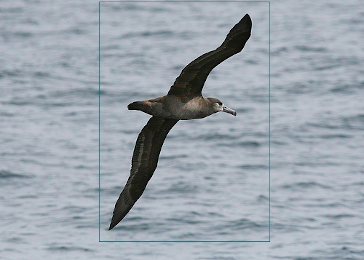
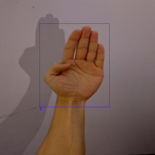

**Object detection** detects one or more objects within an image and assigns each one of them a label, as opposed 
to image classification which assigns a lable to the whole image. The predicted locations are typically rectangles
(aka bounding boxes). If you are looking for shapes or polygons, then have a look at [instance segmentation](../instance_segmentation/index.md).

 

Before you delve into training models, take a look at how you need to [annotate your data](annotate.md).

The following frameworks are available:

* [MMDetection](mmdetection.md)
* [Yolov5](yolov5.md)
