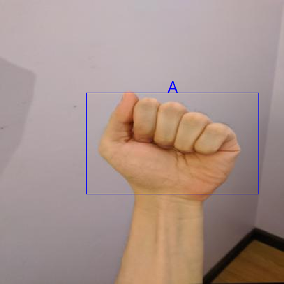
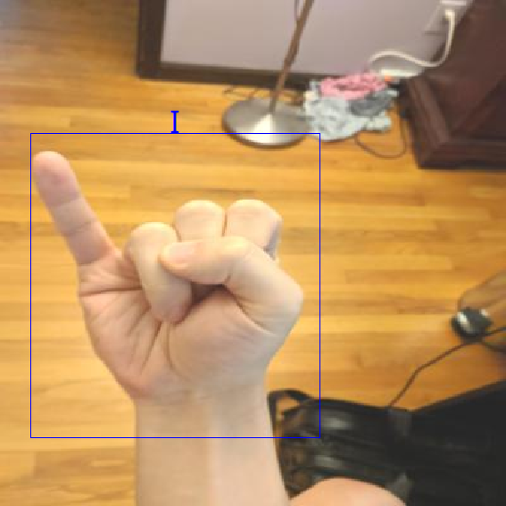

[PaddleDetection](https://github.com/PaddlePaddle/PaddleDetection) is an Object Detection toolkit based on PaddlePaddle. 
It supports object detection, instance segmentation, multiple object tracking and real-time multi-person keypoint detection. 
Custom docker images with additional tools are available from here:

[https://github.com/waikato-datamining/paddledetection](https://github.com/waikato-datamining/paddledetection)


# Prerequisites
Make sure you have the directory structure created as outlined in the [Prerequisites](../prerequisites.md).


# Data

In this example, we will use the [American Sign Language Letters](https://datasets.cms.waikato.ac.nz/ufdl/american-sign-language-letters/)
dataset, which consists of sets of images of hands, one per letter in the English alphabet (26 labels).

Download the dataset from the following URL into the *data* directory and extract it:

[https://datasets.cms.waikato.ac.nz/ufdl/data/american-sign-language-letters/american-sign-language-letters-voc.zip](https://datasets.cms.waikato.ac.nz/ufdl/data/american-sign-language-letters/american-sign-language-letters-voc.zip)

Once extracted, rename the *voc* directory to *sign-voc*.

Now we have to convert the format from *VOC XML* into *MS COCO*. We can do this by using the 
[image-dataset-converter](https://github.com/waikato-datamining/image-dataset-converter) library. 
At the same time, we can split the dataset into *train*, *validation* and *test* subsets.

From within the `applied_deep_learning` directory, run the following command:

```bash
docker run --rm -u $(id -u):$(id -g) \
  -v `pwd`:/workspace \
  -t waikatodatamining/image-dataset-converter:0.0.4 \
  idc-convert \
    -l INFO \
    from-voc-od \
      -i "/workspace/data/sign-voc/*.xml" \
    to-coco-od \
      -o /workspace/data/sign-coco-split/ \
      --category_output_file labels.txt \
      --split_names train val test \
      --split_ratios 70 15 15
```


# Training

For training, we will use the following docker image:

```
waikatodatamining/paddledetection:2.8.0_cuda11.8
```

Inference is possible without a GPU as well (though much, much slower).
For utilizing a CPU you can use the following docker image:

```
waikatodatamining/paddledetection:2.8.0_cpu
```

The training script is called `paddledet_train`, for which we can invoke the help screen as follows:

```bash
docker run --rm \
  -t waikatodatamining/paddledetection:2.8.0_cuda11.8 \
  paddledet_train --help 
```

It is good practice creating a separate sub-directory for each training run, with a directory name that hints at
what dataset and model were used. So for our first training run, which will use mainly default parameters, we will 
create the following directory in the `output` folder:

```
sign-paddle-yolov3
```

Before we can train, we will need to obtain and customize a config file. Within the container,
you can find example configurations for various architectures in the following directory:

```
/opt/PaddleDetection/configs
```

Using the `paddledet_export_config` command, we can expand and dump one of these configurations for our
own purposes:

```bash
docker run --rm \
  -u $(id -u):$(id -g) \
  --gpus=all \
  -v `pwd`:/workspace \
  -v `pwd`/cache/visualdl:/.visualdl \
  -v `pwd`/cache:/.cache \
  -v `pwd`/cache:/opt/PaddleDetection/~/.cache \
  -t waikatodatamining/paddledetection:2.8.0_cuda11.8 \
  paddledet_export_config \
  -i /opt/PaddleDetection/configs/yolov3/yolov3_mobilenet_v1_270e_coco.yml \
  -o /workspace/output/sign-paddle-yolov3/yolov3_mobilenet_v1_270e_coco.yml \
  -O /workspace/output/sign-paddle-yolov3 \
  -t /workspace/data/sign-coco-split/train/annotations.json \
  -v /workspace/data/sign-coco-split/val/annotations.json \
  --save_interval 10 \
  --num_epochs 50 \
  --num_classes 26
```

Kick off the training with the following command:

```bash
docker run --rm \
  -u $(id -u):$(id -g) \
  --shm-size 8G \
  --gpus=all \
  -v `pwd`:/workspace \
  -v `pwd`/cache/visualdl:/.visualdl \
  -v `pwd`/cache:/.cache \
  -v `pwd`/cache:/opt/PaddleDetection/~/.cache \
  -t waikatodatamining/paddledetection:2.8.0_cuda11.8 \
  paddledet_train \
  -c /workspace/output/sign-paddle-yolov3/yolov3_mobilenet_v1_270e_coco.yml \
  --eval \
  -o use_gpu=true
```

Export the model using the `paddledet_export_model` script:

```bash
docker run --rm \
  -u $(id -u):$(id -g) \
  --shm-size 8G \
  --gpus=all \
  -v `pwd`:/workspace \
  -v `pwd`/cache/visualdl:/.visualdl \
  -v `pwd`/cache:/.cache \
  -v `pwd`/cache:/opt/PaddleDetection/~/.cache \
  -t waikatodatamining/paddledetection:2.8.0_cuda11.8 \
  paddledet_export_model \
  -c /workspace/output/sign-paddle-yolov3/yolov3_mobilenet_v1_270e_coco.yml \
  --output_dir /workspace/output/sign-paddle-yolov3/inference
```


# Predicting

Using the `paddledet_predict` script, we can batch-process images placed in the `predictions/in` directory
as follows (e.g., from our *test* subset): 

```bash
docker run --rm \
  -u $(id -u):$(id -g) \
  --shm-size 8G \
  --gpus=all \
  -v `pwd`:/workspace \
  -v `pwd`/cache/visualdl:/.visualdl \
  -v `pwd`/cache:/.cache \
  -v `pwd`/cache:/opt/PaddleDetection/~/.cache \
  -t waikatodatamining/paddledetection:2.8.0_cuda11.8 \
  paddledet_predict_poll \
  --model_path /workspace/output/sign-paddle-yolov3/inference/yolov3_mobilenet_v1_270e_coco \
  --device gpu \
  --label_list /workspace/data/sign-coco-split/train/labels.txt \
  --prediction_in /workspace/predictions/in \
  --prediction_out /workspace/predictions/out
```

**Notes** 

* The predictions get output in [OPEX JSON format](https://github.com/WaikatoLink2020/objdet-predictions-exchange-format),
  which can view the predictions with the ADAMS *Preview browser*:
  
    * [OPEX](../../previewing_predictions/#objdet_opex)

**Example prediction**

 


