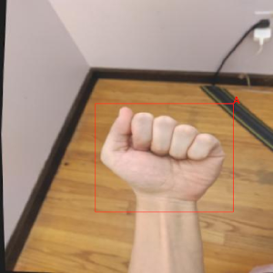
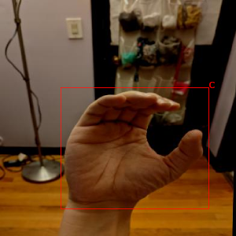

[Yolov5](https://github.com/ultralytics/yolov5) is a family of object detection architectures and models pretrained on 
the COCO dataset, and represents Ultralytics open-source research into future vision AI methods. 
Custom docker images with additional tools are available from here:

[https://github.com/waikato-datamining/pytorch/tree/master/yolov5](https://github.com/waikato-datamining/pytorch/tree/master/yolov5)


# Prerequisites
Make sure you have the directory structure created as outlined in the [Prerequisites](../prerequisites.md).


# Data

In this example, we will use the [American Sign Language Letters](https://datasets.cms.waikato.ac.nz/ufdl/american-sign-language-letters/)
dataset, which consists of sets of images of hands, one per letter in the English alphabet (26 labels).

Download the dataset from the following URL into the *data* directory and extract it:

[https://datasets.cms.waikato.ac.nz/ufdl/data/american-sign-language-letters/american-sign-language-letters-voc.zip](https://datasets.cms.waikato.ac.nz/ufdl/data/american-sign-language-letters/american-sign-language-letters-voc.zip)

Once extracted, rename the *voc* directory to *sign-voc*.

Now we have to convert the format from *VOC XML* into *YOLO*. We can do this by using the 
[image-dataset-converter](https://github.com/waikato-datamining/image-dataset-converter) library. 
At the same time, we can split the dataset into *train*, *validation* and *test* subsets.

From within the `applied_deep_learning` directory, run the following command:

```bash
docker run --rm -u $(id -u):$(id -g) \
  -v `pwd`:/workspace \
  -t waikatodatamining/image-dataset-converter:0.0.4 \
  idc-convert \
    -l INFO \
    from-voc-od \
      -i "/workspace/data/sign-voc/*.xml" \
    to-yolo-od \
      -o /workspace/data/sign-yolo-split \
      --labels labels.txt \
      --labels_csv labels.csv \
      --split_names train val test \
      --split_ratios 70 15 15
```

Finally, download the [dataset.yaml](img/dataset.yaml) file and place it in the `sign-yolo-split`
directory. It contains information about the dataset directory, the splits and the class labels.

If you want to adapt this configuration for different labels, then you can automatically 
transform the `labels.txt` file into a quoted list using the following command:

```bash
cat labels.txt | sed s/,/\',\'/g | sed s/^/\'/g | sed s/$/\'/g
```


# Training

For training, we will use the following docker image:

```
waikatodatamining/pytorch-yolov5:2022-11-05_cuda11.1
```

If you do not have a GPU, you can use the CPU-only image:

```
waikatodatamining/pytorch-yolov5:2022-11-05_cpu
```

The training script is called `yolov5_train`, for which we can invoke the help screen as follows:

```bash
docker run --rm -t waikatodatamining/pytorch-yolov5:2022-11-05_cuda11.1 yolov5_train --help 
```

Instead of using config files, we can just tweak parameters via command-line options.

However, we still need to download a base model to use for training. Yolov5 offers different
models, which differ in speed and accuracy. We will use the *medium* one called `yolov5m.pt`
from the `v6.2` release:

[https://github.com/ultralytics/yolov5/releases/download/v6.2/yolov5m.pt](https://github.com/ultralytics/yolov5/releases/download/v6.2/yolov5m.pt)

Download it and place it in the `models` directory.

It is good practice creating a separate sub-directory for each training run, with a directory name that hints at
what dataset and model were used. So for our first training run, which will use mainly default parameters, we will 
create the following directory in the `output` folder:

```
sign-yolov5
```

Since the image size should be a multiple of 32, we use 416 for this experiment.

Kick off the training with the following command:

```bash
docker run --rm \
  -u $(id -u):$(id -g) \
  --shm-size 8G \
  --gpus=all \
  -v `pwd`:/workspace \
  -t waikatodatamining/pytorch-yolov5:2022-11-05_cuda11.1 \
  yolov5_train \
  --img 416 \
  --batch 16 \
  --epochs 50 \
  --data /workspace/data/sign-yolo-split/dataset.yaml \
  --weights /workspace/models/yolov5m.pt \
  --project /workspace/output \
  --name sign-yolov5 \
  --exist-ok
```

# Exporting to ONNX

Before we can use our trained model, we will need to export it to [ONNX format](https://onnx.ai/)
using the `yolov5_export` script:

```bash
docker run --rm \
  -u $(id -u):$(id -g) \
  --gpus=all \
  -v `pwd`:/workspace \
  -t waikatodatamining/pytorch-yolov5:2022-11-05_cuda11.1 \
  yolov5_export \
  --weights /workspace/output/sign-yolov5/weights/best.pt \
  --img-size 416 416 \
  --include onnx
```

This will create a file called `best.onnx` in the output directory.


# Predicting

Using the `yolov5_predict_poll` script, we can batch-process images placed in the `predictions/in` directory
as follows (e.g., from our *test* subset): 

```bash
docker run --rm \
  -u $(id -u):$(id -g) \
  --gpus=all \
  -v `pwd`:/workspace \
  -t waikatodatamining/pytorch-yolov5:2022-11-05_cuda11.1 \
  yolov5_predict_poll \
  --model /workspace/output/sign-yolov5/weights/best.onnx \
  --data /workspace/data/sign-yolo-split/dataset.yaml \
  --image_size 416 \
  --prediction_in /workspace/predictions/in \
  --prediction_out /workspace/predictions/out
```

**Notes** 

* By default, the predictions get output in [ROI CSV format](https://github.com/waikato-datamining/image-dataset-converter/blob/main/formats/roicsv.md).
  But you can also output them in the [OPEX JSON format](https://github.com/WaikatoLink2020/objdet-predictions-exchange-format) 
  by adding `--prediction_format opex --prediction_suffix .json` to the command.

* You can view the predictions with the ADAMS *Preview browser*:
  
    * [ROIS CSV](../../previewing_predictions/#objdet_rois)
    * [OPEX](../../previewing_predictions/#objdet_opex)

**Example prediction**

 




# Troubleshooting

* If you are re-using a dataset that was used by another YolovX framework, you
  may get strange error messages when reading the data. This can be due to 
  incompatible cache files that get generated to speed up loading the data. 
  Make sure to remove all files in the `labels` directory that have a `.cache` 
  extension.
  