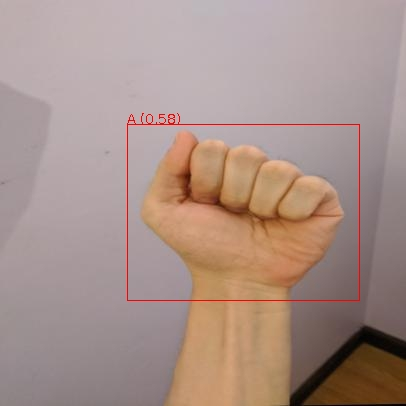
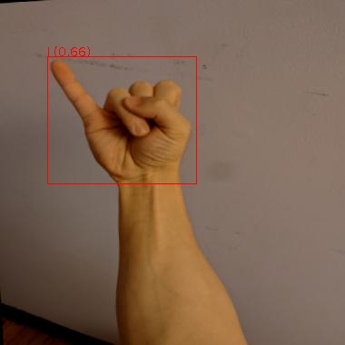

[Yolov7](https://github.com/WongKinYiu/yolov7) represents the implementation of 
[YOLOv7: Trainable bag-of-freebies sets new state-of-the-art for real-time object detectors](https://arxiv.org/abs/2207.02696). 
Custom docker images with additional tools are available from here:

[https://github.com/waikato-datamining/pytorch/tree/master/yolov7](https://github.com/waikato-datamining/pytorch/tree/master/yolov7)


# Prerequisites
Make sure you have the directory structure created as outlined in the [Prerequisites](../prerequisites.md).


# Data

In this example, we will use the [American Sign Language Letters](https://datasets.cms.waikato.ac.nz/ufdl/american-sign-language-letters/)
dataset, which consists of sets of images of hands, one per letter in the English alphabet (26 labels).

Download the dataset from the following URL into the *data* directory and extract it:

[https://datasets.cms.waikato.ac.nz/ufdl/data/american-sign-language-letters/american-sign-language-letters-voc.zip](https://datasets.cms.waikato.ac.nz/ufdl/data/american-sign-language-letters/american-sign-language-letters-voc.zip)

Once extracted, rename the *voc* directory to *sign-voc*.

Now we have to convert the format from *VOC XML* into *YOLO*. We can do this by using the 
[wai.annotations](https://github.com/waikato-ufdl/wai-annotations) library. 
At the same time, we can split the dataset into *train*, *validation* and *test* subsets.

From within the `applied_deep_learning` directory, run the following command:

```bash
docker run -u $(id -u):$(id -g) \
  -v `pwd`:/workspace \
  -t waikatoufdl/wai.annotations:latest \
  wai-annotations convert \
    from-voc-od \
      -i "/workspace/data/sign-voc/*.xml" \
    to-yolo-od \
      -o /workspace/data/sign-yolo-split \
      --labels /workspace/data/sign-yolo-split/labels.txt \
      --labels-csv /workspace/data/sign-yolo-split/labels.csv \
      --split-names train val test \
      --split-ratios 70 15 15
```

**NB:** At the time of writing, the yolo plugin for wai.annotations still had a bug which 
creates empty top-level directories when splitting datasets via `--split-names`. In the 
`sign-yolo-split` directory, you can safely remove the `train`, `test` and `val` directories, 
since the actual splits are below the `images` and `labels` directories:

```bash
rm -fR data/sign-yolo-split/train data/sign-yolo-split/test data/sign-yolo-split/val
```

Finally, download the [dataset7.yaml](img/dataset7.yaml) file, place it in the `sign-yolo-split`
directory. It contains information about the dataset directory, the splits and the class labels.
Since the labels can come out in a random order, you need to update the labels in the yaml file
with the ones that got output in the `labels.txt` file. You can automatically quote the
comma-separated list using the following command:

```bash
cat data/sign-yolo-split/labels.txt | sed s/,/\',\'/g | sed s/^/\'/g | sed s/$/\'/g
```


# Training

For training, we will use the following docker image:

```
waikatodatamining/pytorch-yolov7:2022-10-08_cuda11.1
```

If you do not have a GPU, you can use the CPU-only image:

```
waikatodatamining/pytorch-yolov7:2022-01-21_cpu
```

The training script is called `yolov7_train`, for which we can invoke the help screen as follows:

```bash
docker run -t waikatodatamining/pytorch-yolov7:2022-10-08_cuda11.1 yolov7_train --help 
```

Since we will be performing transfer larning, we need to download a base model to use for training. 
Yolov7 offers different models, which differ in speed and accuracy. We will use the *fastest* one 
called `yolov7_training.pt` from the `v0.1` release:

[https://github.com/WongKinYiu/yolov7/releases/download/v0.1/yolov7_training.pt](https://github.com/WongKinYiu/yolov7/releases/download/v0.1/yolov7_training.pt)

Download it and place it in the `models` directory.

It is good practice creating a separate sub-directory for each training run, with a directory name that hints at
what dataset and model were used. So for our first training run, which will use mainly default parameters, we will 
create the following directory in the `output` folder:

```
sign-yolov7
```

Next, we need to download two more configuration files into our output directory:

* [yolov7.yaml](https://raw.githubusercontent.com/WongKinYiu/yolov7/072f76c72c641c7a1ee482e39f604f6f8ef7ee92/cfg/training/yolov7.yaml) (architecture)

    adjust the `nc` parameter and just 26 instead of 80

* [hyp.scratch.custom.yaml](https://raw.githubusercontent.com/WongKinYiu/yolov7/072f76c72c641c7a1ee482e39f604f6f8ef7ee92/data/hyp.scratch.custom.yaml) 

    here you can adjust training parameters and also tweak basic image augmentation methods

Since the image size should be a multiple of 32, we use 416 for this experiment.

Kick off the training with the following command:

```bash
docker run \
  -u $(id -u):$(id -g) \
  --shm-size 8G \
  --gpus=all \
  -v `pwd`:/workspace \
  -t waikatodatamining/pytorch-yolov7:2022-10-08_cuda11.1 \
  yolov7_train \
  --workers 1 \
  --device 0 \
  --batch-size 8 \
  --epochs 50 \
  --data /workspace/data/sign-yolo-split/dataset7.yaml \
  --img 416 416 \
  --weights /workspace/models/yolov7_training.pt \
  --project /workspace/output \
  --name sign-yolov7 \
  --exist-ok \
  --hyp /workspace/output/sign-yolov7/hyp.scratch.custom.yaml \
  --cfg /workspace/output/sign-yolov7/yolov7.yaml
```


# Predicting

Using the `yolov7_predict_poll` script, we can batch-process images placed in the `predictions/in` directory
as follows (e.g., from our *test* subset): 

```bash
docker run \
  -u $(id -u):$(id -g) \
  --gpus=all \
  -v `pwd`:/workspace \
  -t waikatodatamining/pytorch-yolov7:2022-10-08_cuda11.1 \
  yolov7_predict_poll \
  --model /workspace/output/sign-yolov7/weights/best.pt \
  --no_trace \
  --prediction_in /workspace/predictions/in \
  --prediction_out /workspace/predictions/out
```

**Notes** 

* The predictions get output in [ROI CSV format](https://github.com/waikato-ufdl/wai-annotations-roi).
* You can view the predictions with the ADAMS *Preview browser*:
  
    * [ROIS CSV](../../previewing_predictions/#objdet_rois)

**Example prediction**

 




# Exporting to ONNX (optional)

Before we can use our trained model, we will need to export it to [ONNX format](https://onnx.ai/)
using the `yolov7_export` script:

```bash
docker run \
  -u $(id -u):$(id -g) \
  --gpus=all \
  -v `pwd`:/workspace \
  -t waikatodatamining/pytorch-yolov7:2022-10-08_cuda11.1 \
  yolov7_export \
  --weights /workspace/output/sign-yolov7/weights/best.pt \
  --grid \
  --end2end \
  --simplify \
  --topk-all 26 \
  --iou-thres 0.65 \
  --conf-thres 0.35 \
  --img-size 416 416 \
  --max-wh 416
```

This will create a file called `best.onnx` in the output directory.


# Troubleshooting

* If you are re-using a dataset that was used by another YolovX framework, you
  may get strange error messages when reading the data. This can be due to 
  incompatible cache files that get generated to speed up loading the data. 
  Make sure to remove all files in the `labels` directory that have a `.cache` 
  extension.
  