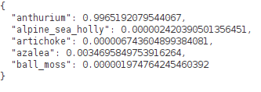

Below you can find ways of previewing predictions generated by the various 
frameworks used through this tutorial. For most of them, you can use
ADAMS' *Preview browser* and a specific content handler. Configurations for 
these handlers can be applied as follows:

* Copy a configuration from below to the clipboard.
* Open the *Preview browser* in ADAMS (under the *Visualization* menu).
* Click on the `...` button at the bottom to bring up the options dialog.
* Click on the `⋁` button at the top right of the dialog and select *Paste setup*.
* Accept the setup by clicking on the `OK` button.


# Domains

## Image classification

### CSV {: #imgcls_csv }

```
adams.gui.tools.previewbrowser.ImageClassificationHandler -image-reader adams.data.io.input.JAIImageReader -reader "adams.data.io.input.ImageClassificationSpreadSheetReportReader -input ${HOME}/temp/preview/image_01965.csv -reader \"adams.data.io.input.CsvSpreadSheetReader -data-row-type adams.data.spreadsheet.DenseDataRow -spreadsheet-type adams.data.spreadsheet.DefaultSpreadSheet\"" -format "$ ({score|.2})"
```

Example:


### JSON {: #imgcls_json }

The following content handler overlays the label and score on the image:

```
adams.gui.tools.previewbrowser.ImageClassificationHandler -image-reader adams.data.io.input.JAIImageReader -reader adams.data.io.input.ImageClassificationJsonReportReader -format "$ ({score|.2})"
```

Example:


## Object detection

### ROIs CSV format {: #objdet_rois }

```
adams.gui.tools.previewbrowser.ObjectAnnotationsHandler -image-reader adams.data.io.input.JAIImageReader -file-suffix -rois.csv -reader "adams.data.io.input.ObjectLocationsSpreadSheetReader -input ${HOME}/temp/preview/A11_jpg.rf.ff2610c21c7f6d0a793cb58efc3bd96e-rois.csv -reader \"adams.data.io.input.CsvSpreadSheetReader -data-row-type adams.data.spreadsheet.DenseDataRow -spreadsheet-type adams.data.spreadsheet.DefaultSpreadSheet\" -row-finder adams.data.spreadsheet.rowfinder.AllFinder -col-left x0 -col-top y0 -col-right x1 -col-bottom y1 -col-polygon-x poly_x -col-polygon-y poly_y -col-type label_str -range-meta-data score" -cleaner "adams.gui.visualization.object.objectannotations.cleaning.OverlapRemoval -finder adams.data.objectfinder.AllFinder -overlap-detection adams.data.objectoverlap.AreaRatio -overlap-removal \"adams.data.overlappingobjectremoval.KeepHighestMetaDataValue -score-key score\"" -shape-plotter adams.gui.visualization.object.objectannotations.shape.NoShape -shape-color "adams.gui.visualization.object.objectannotations.colors.PerType -color-provider adams.gui.visualization.core.DefaultColorProvider" -outline-plotter adams.gui.visualization.object.objectannotations.outline.PolygonOutline -outline-color "adams.gui.visualization.object.objectannotations.colors.PerType -color-provider adams.gui.visualization.core.DefaultColorProvider" -label-plotter "adams.gui.visualization.object.objectannotations.label.Anchored -format \"$ ({score|.2})\"" -label-color "adams.gui.visualization.object.objectannotations.colors.PerType -color-provider adams.gui.visualization.core.DefaultColorProvider" -show-object-panel true
```

Example:


### OPEX format {: #objdet_opex }

```
adams.gui.tools.previewbrowser.ObjectAnnotationsHandler -image-reader adams.data.io.input.JAIImageReader -file-suffix .json -reader "adams.data.io.input.OpexObjectLocationsReader -input ${HOME}/temp/preview/A11_jpg.rf.ff2610c21c7f6d0a793cb58efc3bd96e.json" -cleaner "adams.gui.visualization.object.objectannotations.cleaning.OverlapRemoval -finder adams.data.objectfinder.AllFinder -overlap-detection adams.data.objectoverlap.AreaRatio -overlap-removal \"adams.data.overlappingobjectremoval.KeepHighestMetaDataValue -score-key score\"" -shape-plotter adams.gui.visualization.object.objectannotations.shape.NoShape -shape-color "adams.gui.visualization.object.objectannotations.colors.PerType -color-provider adams.gui.visualization.core.DefaultColorProvider" -outline-plotter adams.gui.visualization.object.objectannotations.outline.PolygonOutline -outline-color "adams.gui.visualization.object.objectannotations.colors.PerType -color-provider adams.gui.visualization.core.DefaultColorProvider" -label-plotter "adams.gui.visualization.object.objectannotations.label.Anchored -format \"$ ({score|.2})\"" -label-color "adams.gui.visualization.object.objectannotations.colors.PerType -color-provider adams.gui.visualization.core.DefaultColorProvider" -show-object-panel true
```

Example:


## Instance segmentation

### ROIs CSV format {: #insseg_rois }

```
adams.gui.tools.previewbrowser.ObjectAnnotationsHandler -image-reader adams.data.io.input.JAIImageReader -file-suffix -rois.csv -reader "adams.data.io.input.ObjectLocationsSpreadSheetReader -input ${HOME}/temp/preview/Abyssinian_10-rois.csv -reader \"adams.data.io.input.CsvSpreadSheetReader -data-row-type adams.data.spreadsheet.DenseDataRow -spreadsheet-type adams.data.spreadsheet.DefaultSpreadSheet\" -row-finder adams.data.spreadsheet.rowfinder.AllFinder -col-left x0 -col-top y0 -col-right x1 -col-bottom y1 -col-polygon-x poly_x -col-polygon-y poly_y -col-type label_str -range-meta-data score" -cleaner "adams.gui.visualization.object.objectannotations.cleaning.OverlapRemoval -finder adams.data.objectfinder.AllFinder -overlap-detection adams.data.objectoverlap.AreaRatio -overlap-removal \"adams.data.overlappingobjectremoval.KeepHighestMetaDataValue -score-key score\"" -shape-plotter "adams.gui.visualization.object.objectannotations.shape.FilledPolygon -bounding-box-fallback-ratio 0.1" -shape-color "adams.gui.visualization.object.objectannotations.colors.PerType -color-provider \"adams.gui.visualization.core.TranslucentColorProvider -alpha 64 -provider adams.gui.visualization.core.DefaultColorProvider\"" -outline-plotter adams.gui.visualization.object.objectannotations.outline.PolygonOutline -outline-color "adams.gui.visualization.object.objectannotations.colors.PerType -color-provider adams.gui.visualization.core.DefaultColorProvider" -label-plotter "adams.gui.visualization.object.objectannotations.label.Anchored -format \"$ ({score|.2})\"" -label-color "adams.gui.visualization.object.objectannotations.colors.PerType -color-provider adams.gui.visualization.core.DefaultColorProvider" -show-object-panel true
```

Example:


## Image segmentation

### Indexed PNG format {: #imgseg_indexed }

The following handler works for indexed PNGs and for grayscale ones:

```
adams.gui.tools.previewbrowser.SimpleImageSegmentationAnnotationsHandler -reader adams.data.io.input.JAIImageReader -overlay-reader "adams.data.io.input.PNGImageReader -color-provider adams.gui.visualization.core.DefaultColorProvider" -colorizer "adams.data.image.transformer.GrayOrIndexedColorizer -color-provider adams.gui.visualization.core.DefaultColorProvider"
```

Example:


# Generic

## Plain text {: #generic_plaintext }

Any text file can be viewed with this handler:

```
adams.gui.tools.previewbrowser.PlainTextHandler
```

## JSON {: #generic_json }

This handler displays JSON in a *pretty printed* way:

```
adams.gui.tools.previewbrowser.JsonPrettyPrintHandler
```

Example:




