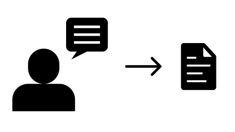

**Speech-to-text** ([STT; also ASR](https://en.wikipedia.org/wiki/Speech_recognition)) transcribes audio files, 
usually short phrases, into text. These models can be used, e.g., for voice assistants that react to spoken 
commands.

What to do next:

* [Annotate your data](annotate.md)
* [Choose a framework](frameworks.md)
